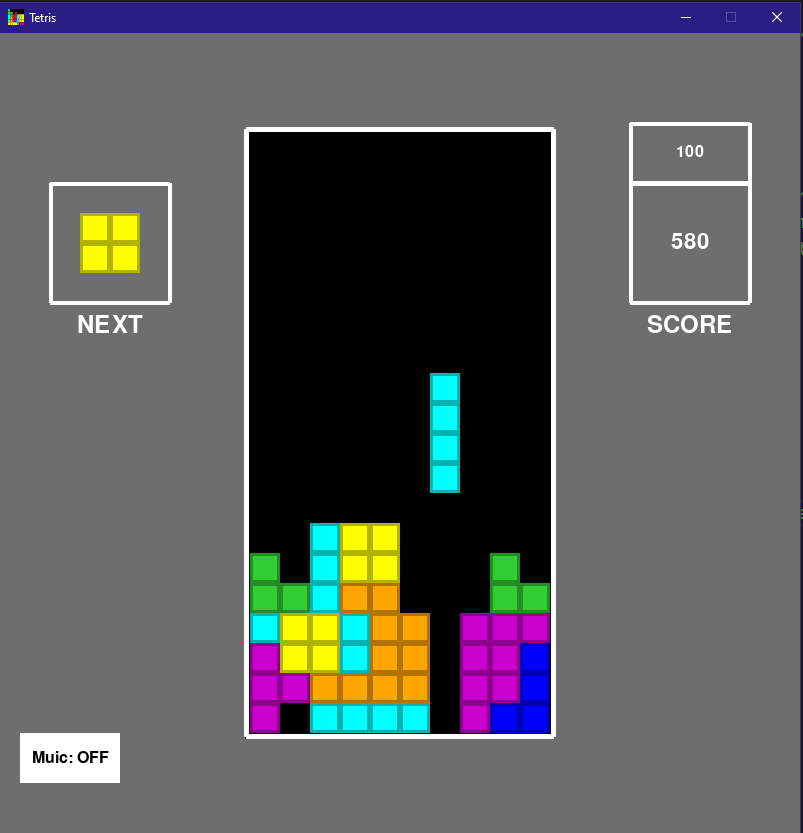

# NES Style Tetris in Pygame

Welcome to the NES Style Tetris repository! This project recreates the classic Tetris game, inspired by the NES version, using Python's Pygame library. It features iconic sound effects and adheres to the NES scoring system, ensuring an authentic retro gaming experience.



## Features

- **Authentic NES Style Graphics**: Relive the classic visuals of the original Tetris on NES.
- **Classic Sound Effects**: Every move, rotation, and line clear comes with nostalgic sounds that take you back in time.
- **NES Scoring System**: Score points just like in the original game. Challenge yourself or your friends to beat high scores!

## Installation

1. Ensure you have Python 3.x installed. You can download it from [Python's official website](https://www.python.org/downloads/).
2. Install Pygame:
   ```bash
   pip install pygame
   ```
   or
   ```bash
   pip3 install pygame
   ```
3. Clone this repository:
   ```bash
   git clone https://github.com/IsaiahHarvi/Tetris.git
   cd Tetris
   ```
4. Run the game:
   ```bash
   python main.py
   ```

## Controls

- **Left Arrow/A**: Move the tetromino left.
- **Right Arrow/D**: Move the tetromino right.
- **Down Arrow/S**: Soft drop.
- **R**: Rotate the tetromino.
- **Space/Enter**: Drop.
- **Esc/M**: Return to menu.

## Scoring System

**LEVEL 0**
    - **Single line**: 40 points
    - **Double line**: 100 points
    - **Triple line**: 300 points
    - **Tetris (4 lines)**: 1200 points

**LEVEL 1**
    - **Single line**: 80 points
    - **Double line**: 200 points
    - **Triple line**: 600 points
    - **Tetris (4 lines)**: 2400 points

**LEVEL 2**
    - **Single line**: 120 points
    - **Double line**: 300 points
    - **Triple line**: 900 points
    - **Tetris (4 lines)**: 3600 points

...

## License

This project is licensed under the MIT License - see the [LICENSE.md](LICENSE.md) file for details.

